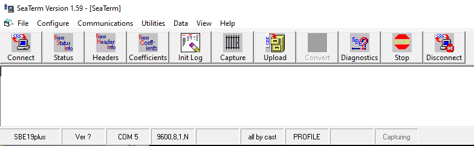

## THIS DOCUMENT HAS BEEN SUPERSCEDED BY THE GOOGLE-DOC AT /SHARED DRIVE/KASISTNA BAY LAB/01-Administration/SOPs-Original_Files/CTD-Recurring_Oceanographic_Survey-manual-Martin


[//]: compile this markdown document to html by issuing something like:   pandoc -s Manual.md -o manual.rtf


## Kachhemak Bay Ecological Sampling Protocols

NOAA's Kasitsna Bay Lab, in collaboration with the Kachemak Bay Estuarine Research Reserve, has been 
conducting oceanographhic and ecological long-term monitoring in Kachemak Bay since 2012. This document 
is based on previous versions compiled by Kim Schuster and James Schloemer. Please direct question to 
Martin Renner martin.renner@noaa.gov.

"Printed on `r format(Sys.time(), '%d %B, %Y')`"

Previous versions included zooplankton, and OA sampling, projects that have been suspended for now.


## Sampling preparations

### CTD
Prior to sampling, the CTD status must be checked to ensure that there is sufficient battery power, logging space, and that settings are correct. Connect to the CTD using SeaTerm v.159 (not SeatermV2), then click 'Connect", then 'Status'. Check that date and time are correct. If these need to be adjusted, issue commands like this example (2023-01-09 09:00:00):
```
MMDDYY=090123
HHMMSS=090000
```
To change the date, the time command has to be issued as well, and visa-versa. We use LOCAL TIME, so it is important to adjust times to daylight-savings-time/standard time. 
- vbatt: battery must be greater than 12 V. If lower, change batteries.
- vlith: replace lithium battery if vlith is < 7 (https://rts.as/wp-content/uploads/2018/09/Seabird-SBE-19plus-Profiler-CTD-manual.pdf page 113).
- casts: CTD stores up to 299 casts. It is advisable to clear the CTD memory after each survey once it has been confirmed that all data has been successfully downloaded. To clear CTD memory, click the 'Init Log' botton. At the very latest, memory should be cleared when approaching 200 casts in memory. 
- mode: MUST be 'profile'. 
Screenshot of Seaterm v1.59 
Document CTD time, date, and voltages in the FileMaker database (layout: CTDstatusLog). 

### iPad
Charge iPad the night before (USB-C charger in blue bag). Also check that there's a pen with a soft stylus bag on the clipboard. Store iPad with screen towards clipboard to protect it. 

FileMaker database: sync to iPad. Write-down last ctd-cast number. Sync-ing procedure: email latest version of FileMaker database to kasitsnabay@icloud.com. Then open Mail.app on iPad, download database, and open directly in FileMaker (replacing old copy). -- last updated on 2023-08-30, MR.

### Staging gear Have the following items handy to bring to the boat:
- note book
- pencils
- CTD
- Niskin bottle 
- phytoplankton bottles (small, white): 6 for monthly 
- nutrient bottles (0.5l brown nalgene): 12 for monthly, +2 quarterly
- Otter-bag with:
  - iPad + USB-C charging cable 
  - zip ties 
  - this protocol 
  - clip-board with data sheets and stylus for iPad
  - MESSENGER WEIGHT 
  - stop-watch 
- Toolbox with: 
  - multimeter 
  - crescent wrench 
  - zip ties 
  - needlenose pliers 
  - electrical tape 
  - phillips screw driver 
  - regular screw driver 
  - leatherman tool


## Monthly and quarterly sampling

Monthly sampling covers transects AlongBay and T9. CTD casts at each station. Time permitting, also do an eBird point count at each station. At stations AB-3, AB-6(=T9-6), and AB-10 also sample nutrients, chlorophyll, and phytoplankton (see below). Quarterly sampling extends AlongBay transect to T7-22 and also covers T6-3, AB-POGR, and AB-POPT and adds Transect 4. Additional water sample at T6-3

### CTD
Verbalize turning on the CTD at the beginning of each cast. Lower the instrument to about 3m, raise it up to the surface (leaving the water intake port well submerged) and let it soak for at least 1 minute (use stop-watch). The lower it to about 5 m above the sounded depth (avoid touching the bottom). On retrieving the instrument, verbalize switching it off.

### Water sampling
Niskin bottle water samples as well as bucket surface water samples are taken at pre-determined stations. XXX details?

### Phytoplankton
Pour 10 l, 20 l, or 40 l (depending on season) of seawater through the 20 μm, 20 cm diameter plankton net. Wash the outside of net down with ambient sea water Collect samples in white plastic bottles. Preserve with 8 drops of Lugal's solution, of practical. Label bottle with date, Transect and station, and amount of water filtered (usually 40 l).

### Notes
Take notes on paper, as before -- at a minimum, date, time, transect, and station numbers; as back-up. 
iPad: There's a sticker on the back of the iPad with the lock-code (99603). Use the soft-tipped stylus pen if your fingers are getting wet. Open iPad (swipe up) and open FileMaker. 

Open FileMakerMoblile on iPad, then open LTMdatabase. To start a new survey, press "NEW Survey". For multi-day (quarterly) surveys, adjust the end-time, as appropriate. At each station, press "NEW Station" and fill out all required fields. When ready to turn on CTD, press "Get Position". 


## Post-cruise cleanup

-   Rinse CTD, Niskin-bottle, nets, everything that was in the water, with freshwater.
-   Flush CTD with DI water: Attach syringe to lower water-intake port and flush with at least 3 full syringes.
-   Store water samples in fridge overnight, if not processing right away. Watersamples need to be processed and frozen within 24 hours of collecting.


## Sample processing

### Nutrients
Piston-sampler syringes stored by pump. Rinse syringe with DI water. Filter onto syringe (use one for all samples, then discard). Press 30 ml from each water sample (brown bottle) through filter into labeled centrifuge plastic vial. Label: date (YYYY-MM-DD), station, deep/surface, replicate 1/2 Freeze in sample freezer.

### Chlorophyll
Use nitril gloves. 25 mm filter paper onto vacuum pump attach 200 ml funnel, fill to 200 ml line turn on vacuum pump bleed vacuum when samples have passed put filter paper into labeled screw-top glass tube freeze dump any seawater outside, not into sink.

### Phytoplankton
Add 8 drops of Lugol's solution to each white sample bottle, if not already treated on board. Leave in Dom's marked drawer.


## Data QAQC, analysis, and archiving

Before CTD data can be used, files have to be downloaded from the instrument, matched with the data from notebooks/iPad, and converted from hex to .csv files. Most of these steps have now been automated. 

### Download CTD
Connect to CTD, as before.
[//]: # Copy from Jim's instructions. 
Two options: batch-downloading and attended download. 
#### Batch download and processing with FileMaker and R
Connect to CTD, as before and display headers. Compare headers to recorded times in FileMaker database, and enter cast numbers. To export notesTable (press "email notes table"),  email notes table to self and copy that csv file to *~/GISdata/LCI/*

When batch-uploading CTD files from instrument to local HD, place all files from one day in a folder (named like S2023-08) within 1_Unedited .hex files. If there are multiple dates, add subfolders labeled with date and transect (as before) and move files into those subfolders once batch-upload is completed. When prompted, supply a file name following this convention: YYYY-MM-DD_cast. Seaterm will add the three-digit cast numbers to the end of the filename. 

Open R and run I-ctd_uneditedHexFiles.R interactively. Correct any errors (usually bad filenames) until you get a clean run. At this stage, edited hex-files should be in the appropriate folder in *~/GISdata/LCI/CTD-processing/Workspace/ctd-data_2017-ongoing/*. Upload a copy to the workspace. 

Generate NoteBook pdf from FileMaker and upload it to the WorkSpace. 
https://researchworkspace.com/campaingn/2562960/evos-gulf-watch-2017-ongoing Environmental Drivers: Oceanographic monitoring in Cook Inlet and Kachemak Bay > Data, 2017-ongoing > Fiel notes > "year"

If producing PDF from paper notes, you can scan directly to PDf. Or, photograph pages with an iPhone. Select all the images, -> share -> print. Then share the resultant PDF and email it to yourself. Open PDf on computer with Acrobat and save with reduced space. 
#### Attended download
If working manually: scan handwritten notes to pdf. Then upload that pdf to the WorkSpace, as above. 
#### Process and archive CTD files
Edited hex files are to be named YYYY_MM_DD_TR_STN_cast###.hex, e.g. 2023_03_28_AB_S2_cast185.hex. Place all hex files from e.g. March 2023 workspace folder ctd-data_2017-ongoing/2_Edited .hex files/2023/2023-03/
To process these files, place another copy on your local computer in ~/Documents/GISdata/LCI/CTD-processing/Workspace/ctd-data_2017-ongoing/2_Edited .hex files/2023/2023-03/ 

Whenever new files have been added to the data repository, the following git commands should be issued: 
```
git add <new survey folder>
git commit -m 'Add survey YYYY-MM'
```

See Appendix below for the necessary set-up and software installation. To process new CTD files, enter the following commands in R: 

```
rFolder <- "~/myDocs/R-scripts"
## set up folder for R scripts and pull scripts from github
setwd (rFolder)
system ("git update")
source ("runAll.R")
# source ("ctd_processing.R")
````
This will batch-process CTD files using SEABIRD software, do some basic QAQC, and update all the routine plots and analysis, State-of-the-Bay, etc. Some functions require an internet connection, some need a connection to the NCCOS VPN (update of SWMP data). This may take a while (several hours). After a successful run, plots can be found in *~/tmp/LCI_noaa/media/*. Aggregated CTD .csv files will be in *~/tmp/LCI_noaa/data-products/CTD/*. Using `source ("ctd_processing.R")` instead of `source ("runAll.R)` will only do the .hex to .csv conversion of the CTD files, along with some basic QAQC. 

#### Manual notes (no iPad)
Make a PDF from the hand-written notes. You can use a scanner to PDF. If you have an iPhone, you can photograph all the pages. To make a PDF, select the relevant images -> share -> print -> share (and email it to yourself). The resultant PDF will be huge -- reduce its size by opening it in Acrobat and File -> Reduce File Size.  Name the resultant file YYYY-MM.pdf (using year and month of the survey) and upload to the workspace. 

### Notes on iPad
Use the < > buttons at the bottom of the screen to navigate to the first station of the survey. Comparing times with CTD-times, fill-in cast# for each CTD cast. When done, press "email notes table" and email a copy of the attached table to self. Check your email and copy the attached csv file to *~/GISdata/LCI/*, replacing any previous copy there. Then run I-ctd_uneditedHexFiles.R. Correct any errors that may be detected (usually bad file names). When finished, upload a copy of the edited hex files to the Workspace. 

#### Run a small example dataset
A smaller and faster workflow than *runAll.R* , only plotting the most recent survey (or a user-chosen survey) is under development. 

#### CTD calibration files
Any new calibration files need to be placed into ~/Documents/GISdata/LCI/CTD-processing/Workspace/conFiles/
If an instrument has been newly calibrated but not yet used, place the con-file into "newNotYetUsed" directory. Move it out with the other files once the instrument has been used.

# Appendix: 

## Set-up new computer to communicate with CTD

All installations may need to be done from an admin-account (ask tech-support). 
- Install driver PL2303_Prolific_DriverInstaller_v1200 from https://www.prolific.com.tw/US/ShowProduct.aspx?p_id=225&pcid=41 -- this may or may not be necessary?
- Connect serial cable with USB-to-serial adapter. In device manager, install driver for USB-to-serial adapter (should show up under "other" and be marked with a yellow warning triangle). 
- Install the Seasoft 2.3 software suite from seabird.com:  https://www.seabird.com/cms-view-en.jsa?page=/cms/list-items/seasoft-2-3-0-en.jsp  

Open Seaterm v 1.59. Configure *SBE 19 plus ...* Communication settings: 
* No parity 
* 8 Data bits 
* 9600 boud 
* Mode: RS-232 full duplex
Depending on your RS-232 to USB adapter, your COM-port may be configured on port-6, port-7 or on another (KBRR cable: port-6, NCCOS: 7). Select "Connect" and see whether communications to the instrument can be established. If not, check that the driver is installed (Device Manager), try a different port, check all cable connections, and check that CTD batteries have sufficient voltage. 

Screenshot of Device Manager, showing the missing driver (to be installed by admin) 

There are two ways to go about downloading hex files from the CTD: interactively, adding information to each file as they download, or in a batch process, then adding that information later. Since the download is quite slow, I recommend a batch download. For that, you want to set up Seaterm configurations as follows:
- SBE 19plus Configuration Options: Upload Settings: select Upload data... "By cast number range"
- SBE 19plus Configuration Options: Header Information: select "Don't include default header form in the upload file"


## Setup of local environment for data analysis

### Windows

The following instructions work under Windows 11. Install the following software: 
<!--- [##]: Install required software. Estimated time: --->
- R, version 4.0.0 or later https://cran.r-project.org/bin/windows/base/release.html, now also available directly from 'Software Center', if you have a NOAA laptop.
- git https://git-scm.com/download/win
- Python, https://www.python.org/downloads/
All of these packages can be installed without administrator privileges in the user directory. To work with R, it is recommended to use an IDE, like RStudio (admin rights required for installation) https://www.rstudio.com/categories/rstudio-ide/
In addition, a number of add-on R packages, data-files, Python libraries, and folder-structure are required. These will be automatically set-up with the instructions given below. Due to the required downloads, the initial run may take considerably longer than subsequent runs (package downloads could take hours). 

Open R and paste the following lines of code into the R console to pull CTD data, configuration files, and put them in the appropriate places. Location of the data is hard-coded, so the scripts can find them. 
````
rFolder <- "~/myDocs/amyfiles/"
## set up folder for R scripts and pull scripts from github
dir.create (rFolder , recursive = TRUE)
setwd (rFolder)
system ("git clone https://github.com/akrenner/NOAA-LCI.git")
## set up folder for data and pull data from github
dir.create ("~/GISdata/SWMP/", recursive = TRUE)
setwd ("~/GISdata/")
system ("git clone https://github.com/akrenner/LCI.git")
renv::restore()
````

You will be asked to initiate a new project (say yes) and whether you want to proceed (with package installation), again say yes ('Y'). 
Advanced: In order to push changes to code or data back into the repository and that way share them, you may have to generate a token on the githup.com website. It is recommended to generated a ssh key for passwordless communication.

To process CTD, install SEABIRD's python program with pip. Open a git shell and enter: 
````
# on unix
python3 -m pip install seabirdscientific
# on windows
py -m pip install seabirdscientific
````

Finally, some public datasets are needed, not all of which can be downloaded automatically. To produce the figures for the State of Kachemak Bay Report (scripts starting with 'annual_...R'), first download the SWMP data from CDMO: https://cdmo.baruch.sc.edu/get/landing.cfm (Advanced Query System -> Launch -> Choose Zip Files. Select "Kachemak Bay, AK" (leave all stations selected.). Click "Submit locations and proceed to next step". Select from "2001" and To: <current year> and click "Get Files". Once you have the zip file, place it in `~/GISdata/LCI/SWMP/` on your harddrive. This process should be repeated about once a year (you can simply add to the zip files in the SWMP folder). 

### seabird processing and cross-platform compatibility
The established workflow relies on Windows-only SBE software from SEABIRD. However, their latest version is now written in Python and should run under MacOS, gnu/linux, and other unix-like OSs. However, this workflow still needs to be implemented and tested. For now, we're using the windows-only SEABIRD software. 

All R code for this project is cross-platform compatible. While it is possible to run all of this on a macOS or gnu/linux platform as well (and ultimately on the WorkSpace), there are still major hurdles. The main stumbling block is processing hex-files using seabird, Inc. software, which is only available as a windows executable. It is possible to run this software on macOS or gnu/linux platforms, either within a virtual environment, like VirtualDesktop, or using wine. 
<!---
The following approach has worked for me (macOS 13.3, Ventura, x86). Your mileage may vary, especially 
if running Apple silicone.
[//]: # Following https://github.com/Gcenx/wine-on-mac
[//]: # also check out https://www.sysnettechsolutions.com/en/install-wine-macos/
If not present already, install homebrew: https://brew.sh/ Install wine, using homebrew: brew install --no-quarantine gcenx/wine/wine-crossover
[//]: # show this code, but do not execute -- how?
Configure wine setup in your user account: provide access to the relevant folders.
To create a new pure 32-bit prefix, you can run: \$ WINEARCH=win32 WINEPREFIX=\~/.wine32 winecfg
--->

## Acknowledgments: 
This would not have worked out without the help of Jim Schloemer. I also like to thank Kim Schuster for paving the way and Kris Holderied for guiding the way.  


## Outlook
Eventually, it would be desirable to implement this workflow on the workspace itself. This would require running SBEBatch.exe via ‘wine’ inside a docker container. Whether this setup would be of practical use remains to be seen. It would have the advantage that all my verbiage above is then obsolete and all processing could be done online. Whether that’s worth the trouble and a blessing or curse remains to be seen. 
There are also several open source projects to do the same calculations, which has the potential of providing performance benefits and the ability to check what is actually being calculated: 
* https://github.com/gunnarvoet/ctdproc
* https://github.com/wmruef/sumpis 
While promising, I did not evaluate these two options further at this time. Especially ctdproc appears to be under active development – watch this space. 

